# Приложение Клавиатура :

С помощью этого приложения можно создать свою клавиатуру. В нем есть несколько типов настроек,
которые помогут вам настороить
цвет, размер клавиш, шрифт.

<p  align="center">
<code>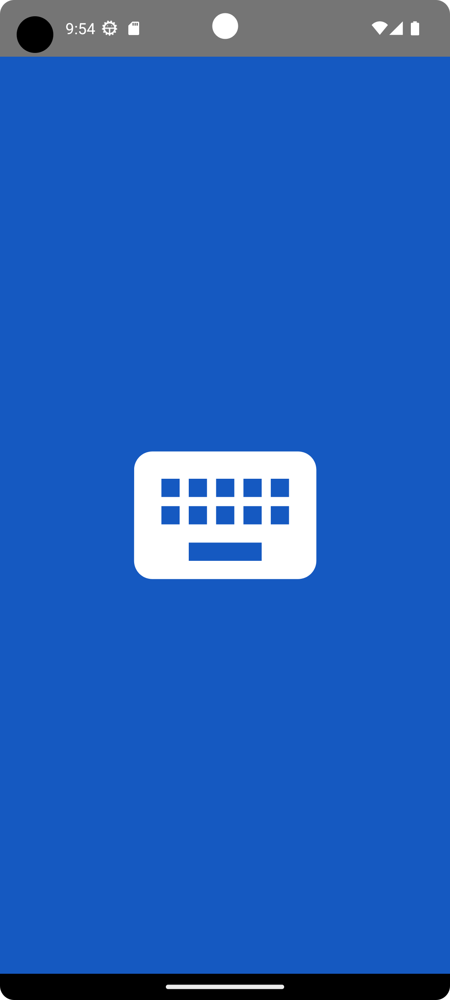</code>
</p>

## Стек используемых технологий

<p  align="left">
<code></code>
<code></code>
<code></code>
<code></code>
<code></code>
<code>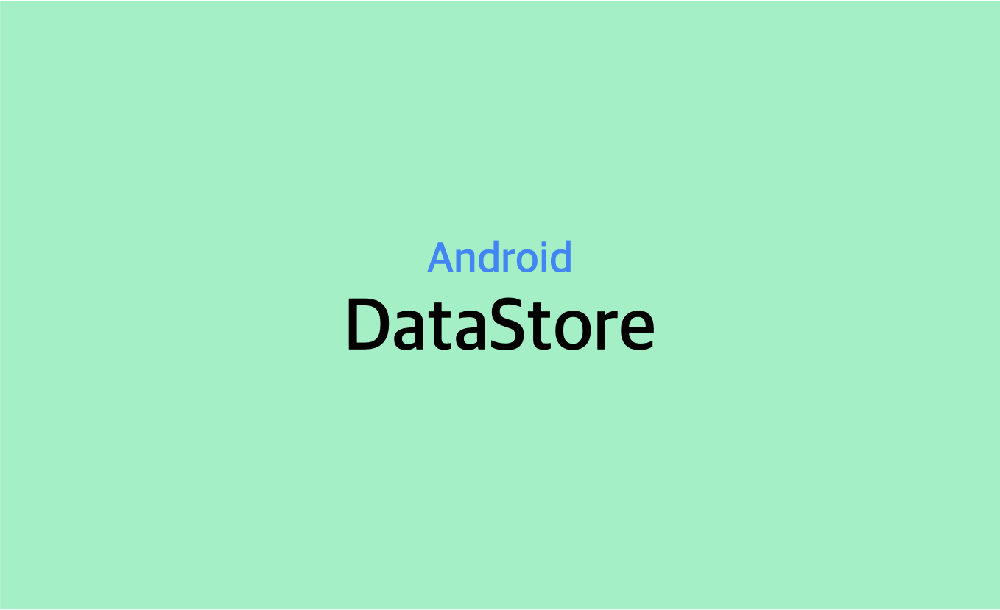</code>

</p>

## Главный экран приложения

<p  align="center">
<code>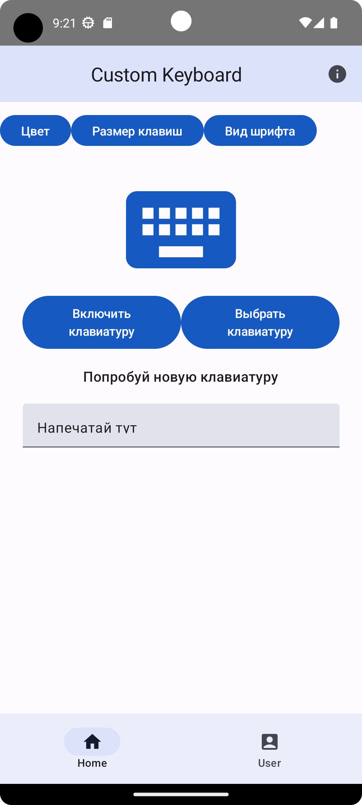</code>
</p>

Для того, чтобы включить клавиатуру, которую мы хотим настроить под себя
нужно тапнуть на кнопку ```Включить клавиатуру```

На экране включения клавиатуры, мы должны включить ```Custom Keyboard IME``` для того,
чтобы использовать ее дальше.

<p  align="center">
<code>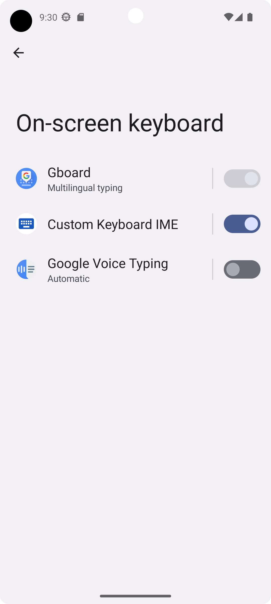</code>
</p>

Для того, чтобы выбрать клавиатуру, которую мы хотим настроить под себя
нужно тапнуть на кнопку ```Выбрать клавиатуру```

<p  align="center">
<code>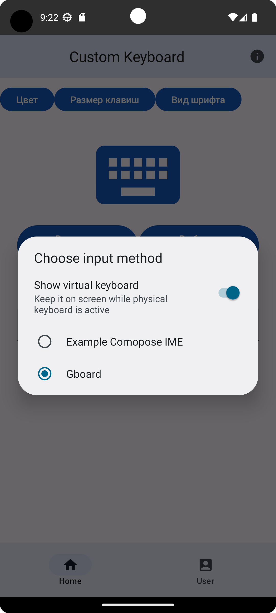</code>
</p>

Что бы узнать информацию про экран можно тапнуть на значок информация в правом верхнем углу.

<p  align="center">
<code>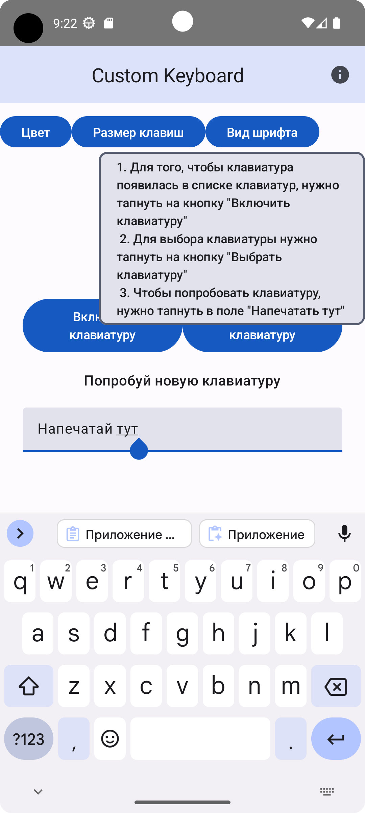</code>
</p>

## Экран смены цвета

Для того, чтобы установить цвет для клавиш нужно выбрать чекбокс ```Цвет клавиш``` и далее тапнуть
на
цветовой круг.

Для того, чтобы установить цвет фона нужно выбрать чекбокс ```Цвет фона``` и далее тапнуть на
цветовой круг.

Чтобы выбранные настройки применились, нужно тапнуть на кнопку ```Применить настройки```

<p  align="center">
<code>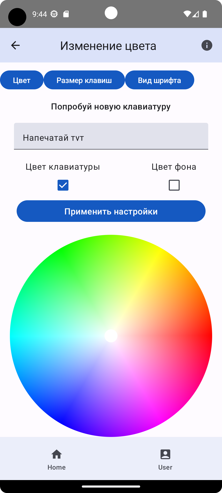</code>
</p>

<p  align="center">
<code>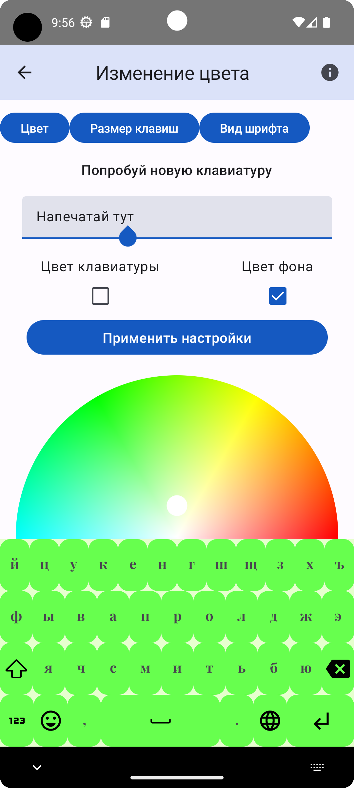</code>
</p>

## Экран смены размера клавиш

Для того, чтобы установить нужный размер для клавиш нужно ввести данные по всем сторанам.
Чтобы выбранные настройки применились, нужно тапнуть на кнопку ```Применить настройки```

<p  align="center">
<code>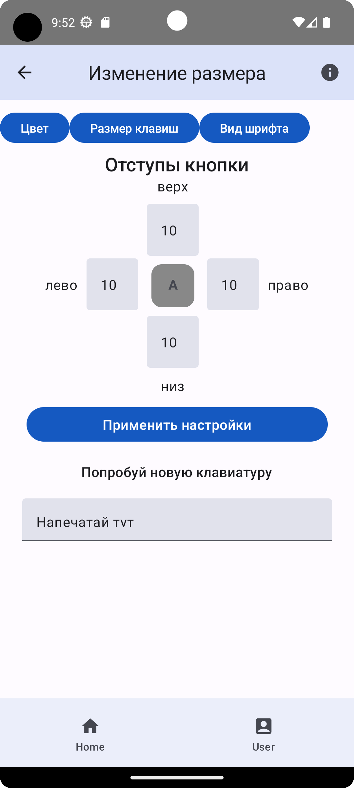</code>
</p>

<p  align="center">
<code>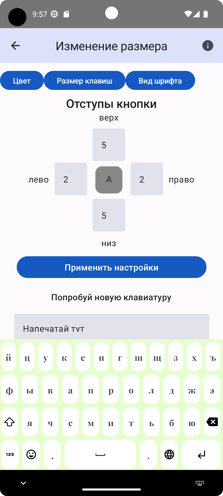</code>
</p>

## Экран смены шрифта

Для того, чтобы установить нужный шрифт для клавиш нужно выбрать интересующий вас шрифт.
Чтобы выбранные настройки применились, нужно тапнуть на кнопку ```Применить настройки```

<p  align="center">
<code>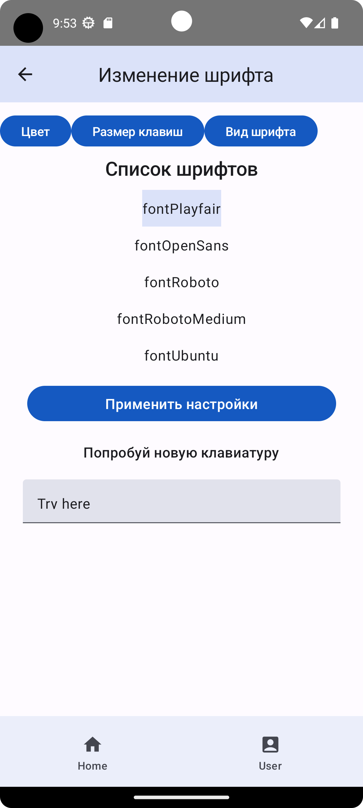</code>
</p>

## Описание файлов проекта

`package data` - тут классы для работы с объектами данных
`package data_store`- библиотека хранения данных Jetpack, которая обеспечивает безопасный способ
хранения небольших объемов данных.
если коротко, то тут мы храним настройки нашей клавиатуры.

`package keyboard` - тут мы храним файлы для работы с нашей клавиатурой.
`class IMEService.kt` - класс для работы с IME android. Тут собственно и происходит настройка
отображения нашей клавиатуры.
`class KeyboardKey.kt` - настройка отображения клавиш.
`class KeyboardKey.kt` - настройка отображения клавиатуры. Отрисовка клавиш с помощью Custom Layout
Compose,
чтобы было удобнее управлять размером дочерних элементов (клавиш).
`KeyboardTemplates` - шаблоны для русской и английской клавиатуры.

`package navigation` - навигация по экранам приложения
`Screens.kt` - описание рутов экранов
`NavGraph.kt` - добавление и свзывание экранов с рутами, чтобы потом можно было добраться к экрану
через navigation.

`package screens` - экраны приложения.